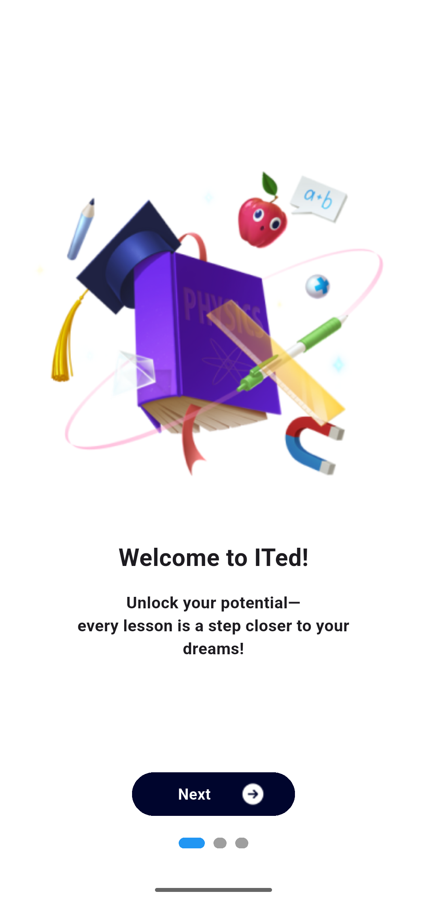

# 📚 Ited E-Study App

**Ited E-Study** is a mobile learning platform designed for college students to access academic resources — including lecture notes, past questions, and a built-in GPA calculator.

This project was built to simulate a full-stack educational solution with user-friendly design and real-world backend integration.

---

## 🚀 Features

- 📄 Browse lecture notes, past questions, and academic materials
- 📊 Calculate GPA using the in-app calculator
- 📂 Upload & view documents stored on the cloud
- 🔐 Secure login and signup
- 🧭 Simple, intuitive user interface

---

## 🛠️ Tech Stack

**Frontend:** Flutter, Riverpod  
**Backend:** NestJS (Node.js), Mongodb  
**Storage:** Cloudinary for file uploads  
**State Management:** Riverpod  
**Authentication:** JWT

---

## 📸 Screenshot



---

## 🧪 Installation (Flutter Frontend)

### Prerequisites

- Flutter SDK: [Install Flutter](https://flutter.dev/docs/get-started/install)
- Dart SDK (comes with Flutter)
- Android Studio or VS Code

### Setup

```bash
git clone https://github.com/yourusername/ited-e-study.git
cd ited-e-study
flutter pub get
flutter run
```

⚠️ Backend Note
The backend was built with NestJS and uses Cloudinary for media storage.
API documentation is currently not included in this version.
